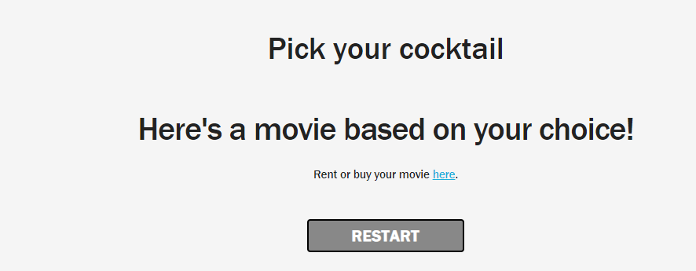

# Cocktails and Cinema
The purpose of the app is to provide an easy way to pick a movie using a cocktail choice. 

# Tasks completed 
<ul> 
<li> Used a CSS framework other than bootstrap </li>
<li>Deployed to GitHub Pages </li>
<li>User Interface is interactive and responsive </li>
<li>Used 2 separate APIs </li>
<li>Used client-side storage to store persistent data </li> 
</ul>

# Link
 
<a href="https://eisforgene.github.io/cocktails-cinema/" target="_blank">Deployed link </a>

<a href="https://github.com/eisforgene/cocktails-cinema" target="_blank"> Github Repo </a>

# Installation 
Make sure all assets are accounted for. 

# Usage 
The app is used to create an easy way to choose a movie.  

# Credits 
API’s Used 
<ol>
<li> https://www.thecocktaildb.com</li>
<li>http://www.omdbapi.com </li>
</ol>

# imgaes 
